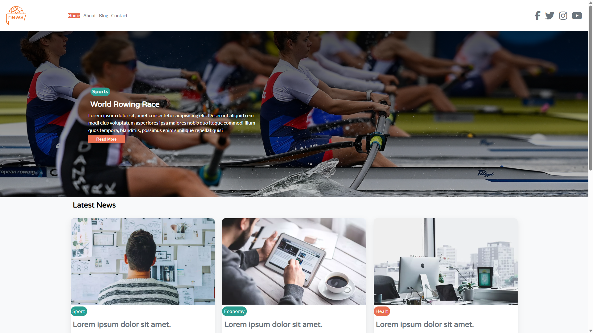
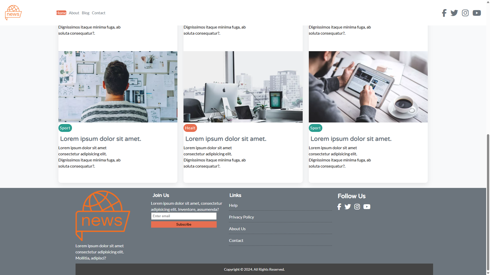
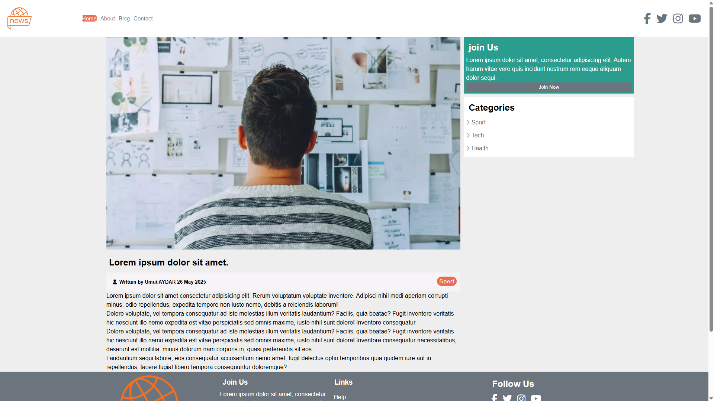

# 📰 News Website

A modern and responsive news website created using **HTML5, CSS3, Flexbox & Grid**.  
The project includes a featured hero section, category-based news cards, article page, sidebar widgets, and a clean multi-section footer.

---

## 🚀 Technologies Used

---

## 📸 Screenshots

### 🏁 Home – Hero Section

### 📰 Latest News

### 📄 Article Page

---

## ✨ Features

- Fully responsive layout (mobile, tablet, desktop)
- Modern hero section with overlay text
- Category badges (Sport, Tech, Health)
- Multi-column news grid using CSS Grid
- Dedicated article page with sidebar
- Sidebar widgets (Join Us, Categories)
- Clean & modern footer
- Reusable CSS structure
- Font Awesome icons & hover effects

